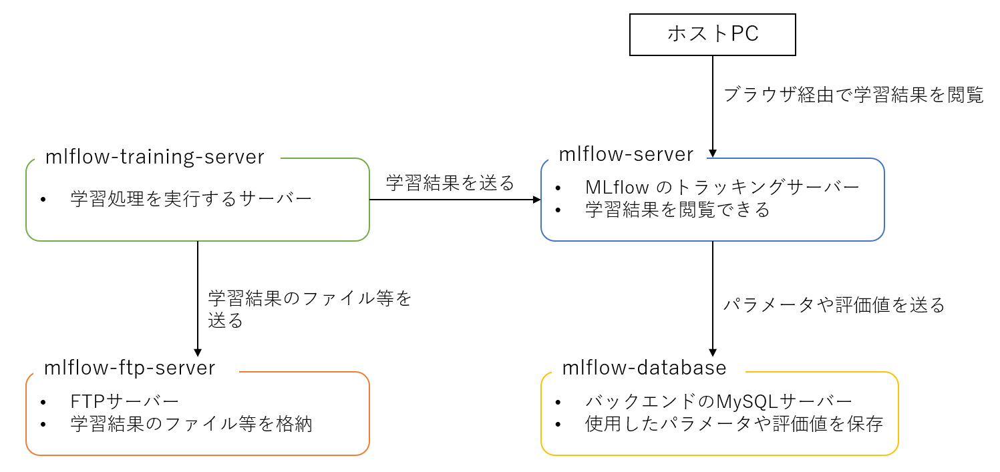

# mlflow-sample
## 1. 概要

本リポジトリは、MLflowでの学習結果の追跡環境一式をDockerコンテナを用いて開発している。開発にあたっては、[MLflowの公式ドキュメント](https://mlflow.org/docs/latest/index.html)、特に[Scenario 3: MLflow on localhost with Tracking Server
](https://mlflow.org/docs/latest/tracking.html#scenario-3-mlflow-on-localhost-with-tracking-server)と[Scenario 4: MLflow with remote Tracking Server, backend and artifact stores
](https://mlflow.org/docs/latest/tracking.html#scenario-4-mlflow-with-remote-tracking-server-backend-and-artifact-stores)を参考にしている。本リポジトリで構築している各Dockerコンテナは以下の通り。



## 2. Dockerコンテナのセットアップ

[docker](docker)ディレクトリに移動した後、以下のコマンドでDockerイメージをビルドする。

```bash
$ docker-compose build
```

Dockerイメージのビルドが完了すると、以下のようにDockerイメージが表示される。

```bash
$ docker images
REPOSITORY         TAG       IMAGE ID       CREATED        SIZE
mlflow-training    v0.1      0a7b6e49db01   10 minutes ago   9.99GB
mlflow-server      v0.1      ac9069a69b58   11 minutes ago   2.33GB
```

その後、以下のコマンドでDockerコンテナを起動する。

```bash
$ docker-compose up -d
[+] Running 5/5
 - Container mlflow-training    Started
 - Container mlflow-database    Started
 - Container mlflow-ftp-server  Started
 - Container mlflow-server      Started
 - Container mlflow-adminer     Started
```

## 3. 学習処理
### 3.1 学習データとテストデータの分割

本リポジトリでは、機械学習の簡単な例である[Red Wine Quality](https://www.kaggle.com/datasets/uciml/red-wine-quality-cortez-et-al-2009)のデータをElasticNetで学習するスクリプトを用意している。学習に先立ち、以下のコマンドで学習データとテストデータを分割する。第1引数は[Red Wine Quality](https://www.kaggle.com/datasets/uciml/red-wine-quality-cortez-et-al-2009)のデータのcsvファイルへのパスを渡す。`--output_dir`と`--random_seed`はオプション引数で、それぞれ出力先ディレクトリと、学習データとテストデータを分ける際のランダムシードの値を指定する。

```bash
python3 split_train_test.py data/winequality-red.csv --output_dir output --random_seed 40
```

### 3.2 学習の実行

以下のコマンドを実行する。第1引数、第2引数はそれぞれ学習データのcsvファイル、テストデータのcsvファイルへのパスを渡す。`--alpha`(デフォルト: 0.5)、`--l1_ratio`(デフォルト: 0.5)及び `--experiment_name`はオプション引数である。`--experiment_name`はMLflowで学習結果を閲覧するときの表示名である。

```bash
$ python3 train.py train.csv test.csv --experiment_name experiment_sample --alpha 0.5 --l1_ratio 0.5
```

## 4. 学習結果の閲覧

ホストPCから<http://localhost:8000/>にアクセスることで、学習結果を閲覧できる。
