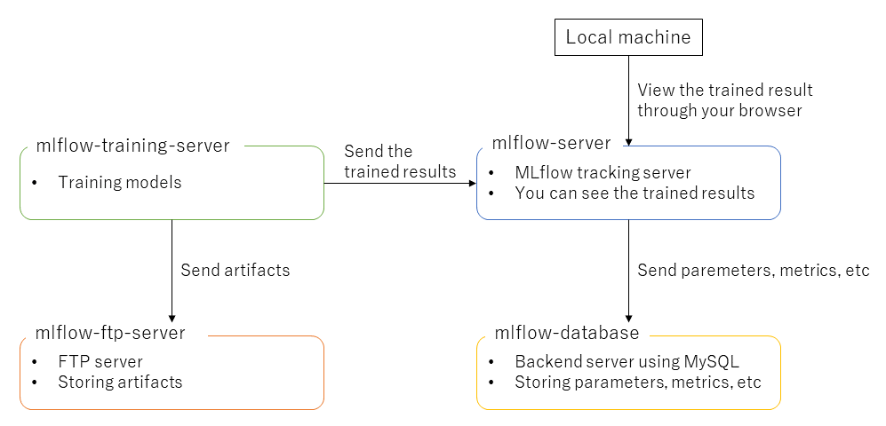

# mlflow-sample
## 1. Overview

This repository has been developed in reference to [MLflow Documentation](https://mlflow.org/docs/latest/index.html), especially MLflow tracking, [Scenario 3: MLflow on localhost with Tracking Server
](https://mlflow.org/docs/latest/tracking.html#scenario-3-mlflow-on-localhost-with-tracking-server) and [Scenario 4: MLflow with remote Tracking Server, backend and artifact stores
](https://mlflow.org/docs/latest/tracking.html#scenario-4-mlflow-with-remote-tracking-server-backend-and-artifact-stores). An overview of the docker containers this repository can set up is below. 



## 2. Setup docker containers

Move to [docker](docker) directory, and build docker images.

```bash
$ docker-compose build
```

Building docker images will be successfully completed if you can find docker images.

```bash
$ docker images
REPOSITORY         TAG       IMAGE ID       CREATED        SIZE
mlflow-training    v0.1      0a7b6e49db01   10 minutes ago   9.99GB
mlflow-server      v0.1      ac9069a69b58   11 minutes ago   2.33GB
```

If you have done that, run the docker containers.

```bash
$ docker-compose up -d
[+] Running 5/5
 - Container mlflow-training    Started
 - Container mlflow-database    Started
 - Container mlflow-ftp-server  Started
 - Container mlflow-server      Started
 - Container mlflow-adminer     Started
```

## 3. Training
### 3.1 Split training and test data

Run below command to save training and test data to `--output_dir` as csv files. `--output_dir` and `--random_seed` are options. The directory that has the input csv file will be set as `--output_dir` if you does not set `--output_dir`. There is uniform selection for splitting training and test data, but you can set `--random_seed` to get various splitted results.


```bash
python3 split_train_test.py data/winequality-red.csv --output_dir output --random_seed 40
```

### 3.2 Run training

Run below command. `--alpha` (default: 0.5), `--l1_ratio` (default: 0.5) and `--experiment_name` are options. `--experiment_name` is display name for mlflow tracking.

```bash
$ python3 train.py train.csv test.csv --experiment_name experiment_sample --alpha 0.5 --l1_ratio 0.5
```

## 4. View trained results

Access to http://localhost:8000/ from your host machine.
